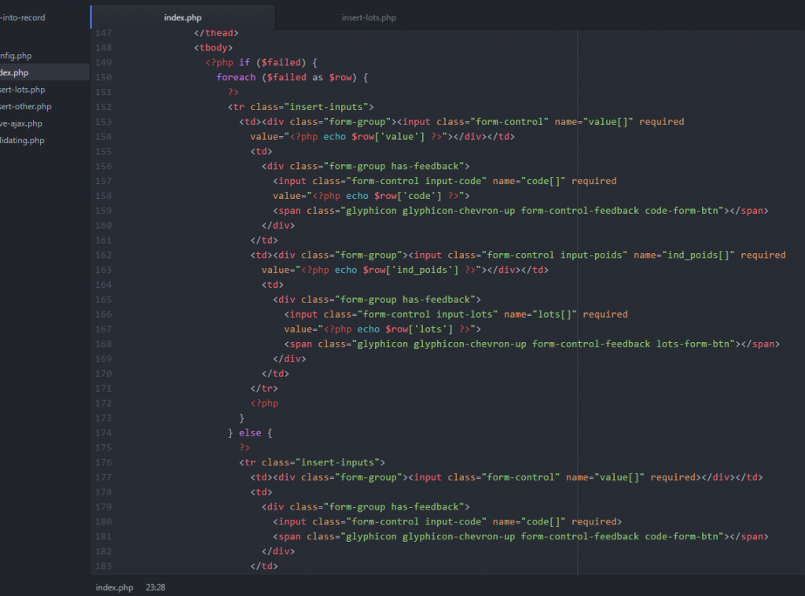
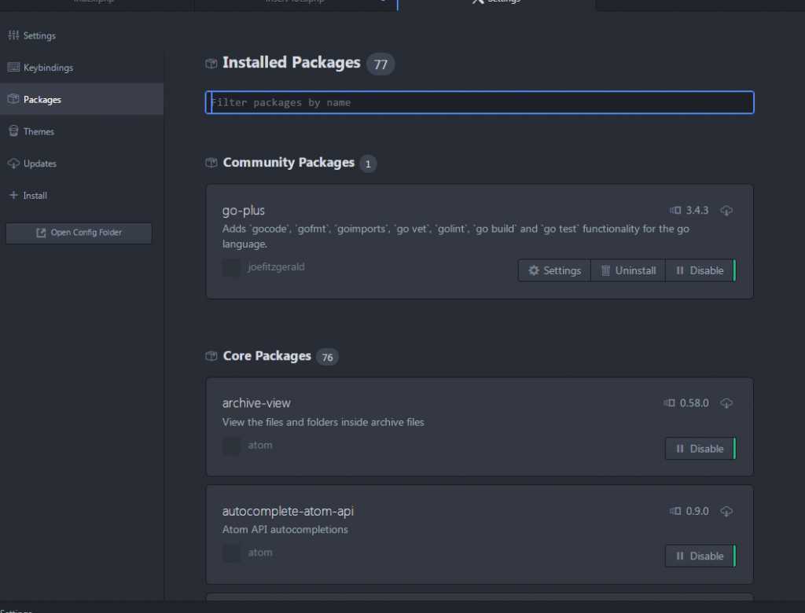

J'ai récemment fais la connaissance avec un nouvel ami qui m'aide à coder plus rapidement et plus facilement : je vous présente [Atom](https://atom.io/).

Atom est un éditeur de texte basé sur chromium (utilisant node.js). Ses inventeurs ont misé sur la possiblité de personnaliser l'éditeur et d'y ajouter de nouvelles fonctionnalités de manière simple.  Le but est que chaque utilisateur soit entièrement à l'aise pour coder (ou editer n'importe-quel texte).  Atom dispose de plusieurs centaines de packages à télécharger pour étendre ses capacités mais aussi de plusieurs thèmes pour personnaliser l'affichage de cet éditeur. Les plugins pour les principaux langages de programmations sont bien évidemment déjà présents, permettant la coloration syntaxique, l'autocomplétion, etc... \[caption id="attachment\_133" align="aligncenter" width="620"\] Les paramètres d'Atom\[/caption\] Je l'utilise maintenant depuis quelques jours et je commence vraiment à apprécier ce petit outil. Je commence également à apprendre à "hacker" Atom comme ils disent, pour y ajouter des fonctionnalités selon mes besoins. Pour cela, il faut un peu de CoffeeScript et une bonne connaissance de CSS. A vous d'essayer cet outil disponible sur Windows, Mac et Linux! A télécharger ici : [https://atom.io/](https://atom.io/). Pour vous convaincre davantage, voici la petite publicité de présentation (d'époque!) que je trouve très drôle.