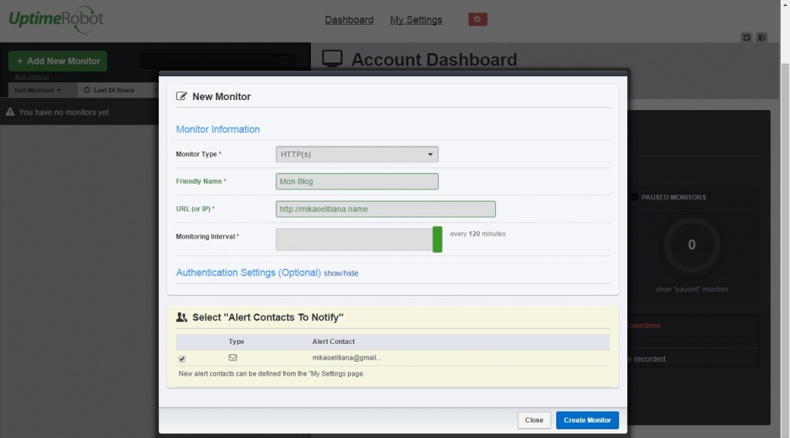

[Uptime Robot](https://uptimerobot.com "Uptime Robot") est un outil web de monitoring permettant d'avoir un suivi de l'état d'un serveur ou d'un système. Il dispose de plusieurs type de monitoring : HTTP, ping, port, keywords. L'inscription et l'utilisation du site est gratuite jusqu'à 50 monitors configurés. Cela est largement suffisant pour une PME ou des freelance ne disposant pas encore de beaucoup de moyen. Une fois le compte créé, on configure le/les moniteurs ainsi que leur fréquence de chargement (entre 5min et 2h). Le système de notifications est aussi très complet et permet de recevoir des alertes par email, SMS, tweet, etc.. \[caption id="attachment\_45" align="aligncenter" width="620"\] Nouveau monitor\[/caption\] Voilà un outil simple et très utile pour suivre plusieurs serveurs et être rapidement alerté en cas de problème. C'est toujours mieux d'être au courant d'une panne avant son client ;) .