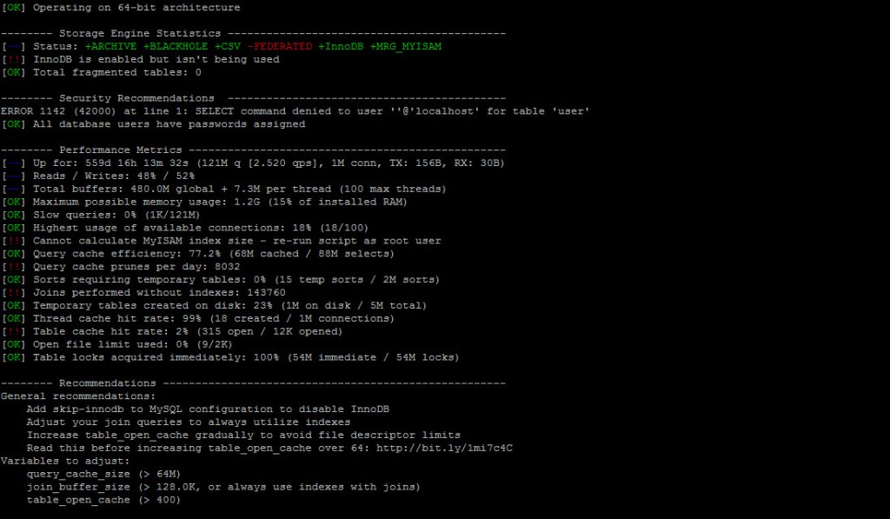
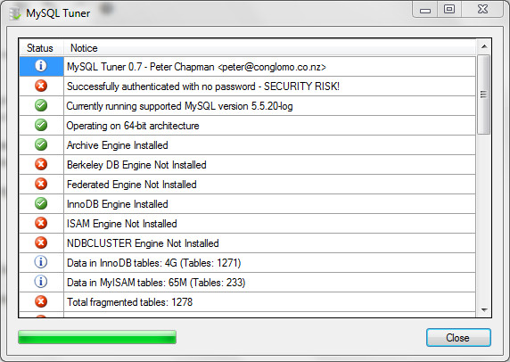

Le web va de plus en plus vite et les utilisateurs sont de plus en plus impatients :) . Il reste important de garder un œil sur les performances d'un projet web et de les optimiser autant que possible. Cette fois-ci, j'ai eu l'occasion d'essayer ce script assez sympa [MySQlTuner](http://mysqltuner.com/ "MySQLTunner") qui analyse le serveur Mysql sur lequel tourne un projet et me donne des pistes d'améliorations à faire sur celui-ci ainsi que des conseils ou des avertissements sur des problèmes de sécurité. Ce script est "inoffensif" puisqu'il n'effectue aucun changement réel sur le serveur mais donne juste les résultats de son analyse. C'est donc aux administrateurs de décider ensuite de la réalisation des actions appropriées. Son utilisation reste très simple puisqu'il il suffit de télécharger le script Perl et de l'exécuter : wget http://mysqltuner.pl/ -O mysqltuner.pl perl mysqltuner.pl Le résultat de l'analyse est alors retourné et permet de voir l'état du serveur, ce qui est OK et ce qui ne l'est pas. \[caption id="attachment\_38" align="aligncenter" width="620" class=" "\] Résultats d'une analyse de MySQLTuner\[/caption\] Pour les utilisateurs WAMP, une version Windows a été compilé [ici ](http://mysqltuner.codeplex.com/ "MySQLTuner Windows") et permet d'exécuter MySQLTuner dans un GUI très simple : \[caption id="attachment\_37" align="aligncenter" width="572" class=" "\] GUI MySQLTuner sur Windows\[/caption\] Des recherches supplémentaires peuvent être ensuite nécessaire pour comprendre chaque retour de l'analyse et voir les impacts des modifications à effectuer.