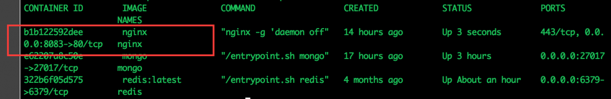

J'ai commencé a tester Docker for Mac aujourd'hui (en version beta) et je vais présenter dans cet article mes premières impressions.

## La fin d'une époque

Tout d'abord, j'utilise déjà activement la précédente version de Docker sur Mac qui est inclue dans le Docker Toolbox. Cette version se basait sur une machine virtuelle sur laquelle tournait un noyau Linux. C'est sur ce dernier que Docker etait donc installé. Avec cette nouvelle version, Docker passe au support natif sur Mac (et parallèlement sur Windows). Cela signifie qu'il n'y a plus besoin de la VM Linux pour faire tourner le programme.

## Tout le monde à la maison!!

Cela engendre plusieurs avantages dans mon utilisation au quotidien. Auparavant mes conteneurs Docker tournaient sur la machine virtuelle et l'accès n'etait pas direct : je ne pouvait pas aisément utiliser _localhost_ pour accéder à une des applications. En effet, il fallait passer par la passerelle de la machine virtuelle (par ex. 192.168.99.100). Aujourd'hui je peux facilement lancer un serveur nginx et l'associer à un port sur _localhost_ comme suit : `docker run -d -p 8083:80 --name nginx nginx`  

## Une question de volume

Un autre avantage est l'amélioration du système de volume. Un volume est une liaison entre un dossier local et un dossier dans un conteneur. Cela permet par exemple de placer des fichiers depuis mon poste de travail vers le dossier DocumentRoot d'un serveur Apache sur Docker. Je peux ainsi travailler sans soucis sur mon editeur favoris (Atom en passant :)) et voir les changement sans aucune autre intervention sur mon conteneur Docker.  Avec cette nouvelle version de Docker vient aussi une nouvelle version de Kitematic qui prend en charge le programme en natif. Kitematic permet de gerer dans une interface visuelle les conteneurs Docker et leur execution. L'interface est tres simple d'utilisation et très accessible. Il permet d'utiliser Docker sans connaître aucunes des commandes de celui-ci. Il reste encore quelques fonctionnalités que je n'ai pas essayé comme la composition avec Docker Compose. J'aurai certainement l'occasion d'en parler dans un autre article.