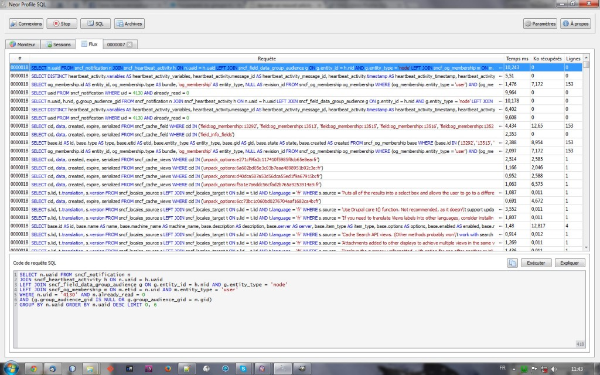
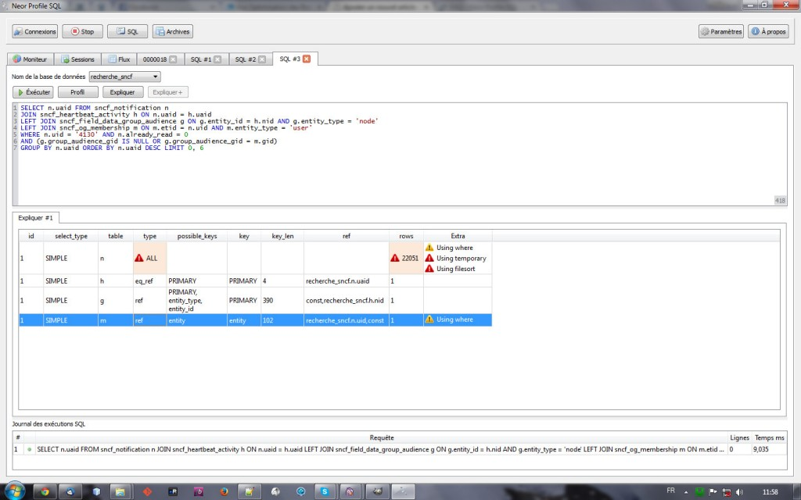

Dans le cadre de l'amélioration de performances d'un site créé sur [Drupal](http://drupal.org "Drupal.org"), j'ai été emmené à effectuer un profiling des requetes SQL du site. J'ai ainsi découvert un outil assez sympa [Neor Profile SQL](http://www.profilesql.com/ "Neor Profile SQL") permettant de voir les requêtes lourdes ou qui se répètent souvent. Cela permettra ensuite de prendre des décision sur les actions à mener pour améliorer le fonctionnement de l'application. Le fonctionnement de l'application est assez simple, il agit comme un proxy pour accéder à la base de donnée et recense ainsi les requêtes. Il dispose donc d'un port sur lequel il écoute les flux vers la DB.  Il faut donc utiliser ce port à la place du port standard 3306 dans la configuration de la base de données. Pour Drupal par exemple, on aura un settings.php ressemblant à ceci (4040 étant le port de Neor) :
```
$ databases = array (
  'default' => 
    array (
      'default' => 
        array (
          'database' => 'YOUR_DB',
          'username' => 'YOUR_USER',
          'password' => 'YOUR_PASS',
          **'host' => '127.0.0.1',**
**'port' => '4040',**
          'driver' => 'mysql',
          'prefix' => '',
        ),
    ),
);
```
Après cette configuration, il est maintenant possible de voir le flux des requêtes dans un onglet de Neor. Nous pouvons alors voir les requêtes qui consomment trop de temps ou trop de bande passante et agir en conséquence. [](http://mikaoelitiana.name/wp-content/uploads/2014/11/neor-2.jpg) Il est possible d'avoir une vue détaillée de chaque requête ainsi que les explications de la requête : [](http://mikaoelitiana.name/wp-content/uploads/2014/11/neor-3.jpg) Je continue à découvrir les fonctionnalités intéressantes de cet outil mais je me réjouis déjà particulièrement qu'il soit disponible sur Mac, Windows et Linux!! Allez vite le récupérer [ici](http://www.profilesql.com/download/ "Telecharger Neor").