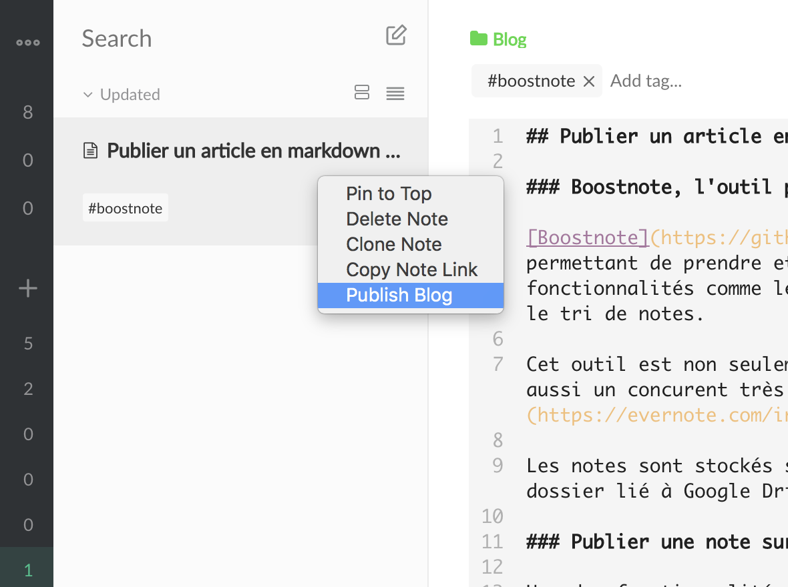

### Boostnote, l’outil pour prendre des notes en markdown

[Boostnote](https://github.com/BoostIO/Boostnote) est un outil très simple permettant de prendre et de gérer du contenu texte en markdown. Il offre des fonctionnalités comme le stockage dans différents dossiers, la recherche ou le tri de notes.

Cet outil est non seulement opensource et en constante évolution, il est aussi un concurent très sérieux à des outils comme [Evernote](https://evernote.com/intl/fr) ou [OneNote](https://evernote.com/intl/fr).

Les notes sont stockés sur le disque dur et peuvent être syncrhonisé dans un dossier lié à Google Drive par exemple.

### Publier une note sur un blog Wordpress

Une des fonctionnalités que j’apprécie particulièrement chez Boostnote est la possibilité de publier un note sur un blog Wordpress. Cela permet donc d’écrire un article en mode hors-connexion et de l’éditer en markdown, ce qui n’est pas disponible de base sur wordpress.

Cet article est le premier que je publie depuis Boostnote et comme vous pouvez le voir, cela fonctionne très bien.

Je recommande donc fortement Boostnote pour ses riches fonctionnalités et je vous invite également à [contribuer](https://github.com/BoostIO/Boostnote/issues) à son amélioration si vous le souhaitez.

