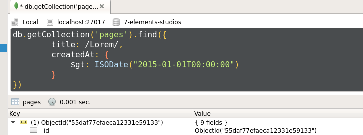
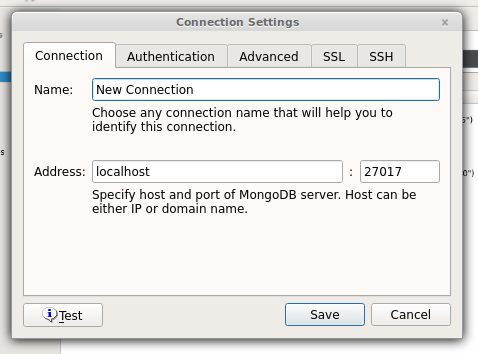

Voici un superbe outil que j'ai commencé à utiliser : [Robomongo](http://robomongo.org/). C'est une interface utilisateur pour gérer les base de données, collections et documents de mongoDB. Il a l'avantage d'être très simple d'utilisation et d'intégrer un shell qui permet de faire n'importe quelle requête comme dans la console du client mongo.  Le logiciel permet de créer, éditer et supprimer des documents de mongoDB. Robomongo gère également la connexion à plusieurs hôtes, permettant ainsi de basculer rapidement d'une instance à une autre.  J'ai trouvé Robomongo très pratique pour mon utilisation quotidienne, il est en plus gratuit et disponible pour Linux, Mac et Windows. Plusieurs nouvelles fonctionnalités sont en cours de développement et les éditeurs ont rendu visible leur [backlog](http://robomongo.org/backlog) pour suivre et encourager les avancées. Rendez-vous donc sur le [site pour découvrir un peu plus et télécharger Robomongo](http://robomongo.org/).