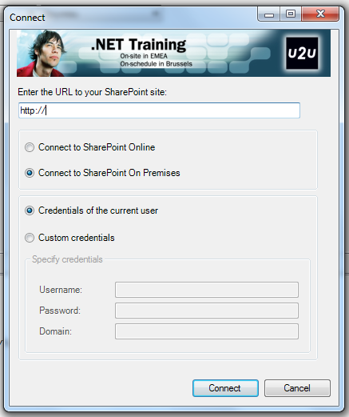
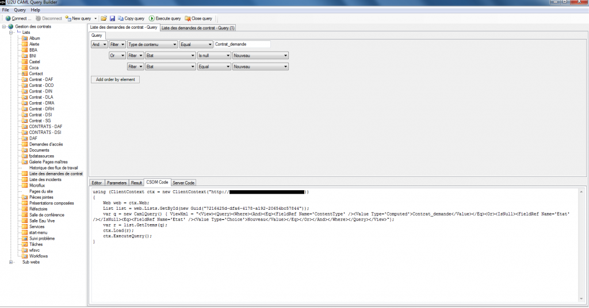

I am currently building a SharePoint application for one of our client to collect data from their site and create a dashboard. Unlike "traditionnal" web applications, SharePoint apps don't access data using SQL (or NoSQL..). Instead, they use [CAML](http://en.wikipedia.org/wiki/Collaborative_Application_Markup_Language) language to build a query  and get data from SharePoint. This language uses markups based on the XML format. Here is a quick example of  a CAML query:
```
<Query>
   <Where>
      <And>
         <Eq>
            <FieldRef Name='ContentType' />
            <Value Type='Computed'>Custom Type</Value>
         </Eq>
         <Or>
            <IsNull>
               <FieldRef Name='Etat' />
            </IsNull>
            <Eq>
               <FieldRef Name='Etat' />
               <Value Type='Choice'>Nouveau</Value>
            </Eq>
         </Or>
      </And>
   </Where>
</Query>
```
We can see tags like Where, Eq, IsNull, etc... that describe the data we want and the conditions to get them. Anyway, it can become really hard to build a query from scratch when conditions and request become complex and I looked for a tool to help me. I found [U2U CAML Query Builder](http://www.u2u.be/Software) was really helpful and easy to use. After downloading and installing the software, I am prompted to login to a SharePoint site when I launch the application. [](./u2u3.png) After that, U2U CAML Query Builder will load all the lists from the SharePoint site and I can select the one where I want to build my query. After this, I can select my query components and execute the query to check it's correct. All attributes from lists items are already loaded and I can select any of them like title, creation date, content type, etc...  And when my query is ready, I can just copy it in CAML format or grab the CSOM or server snippet that execute the query. This tool is a real time-saver!! Comments are really welcomed if you know any similar tool.