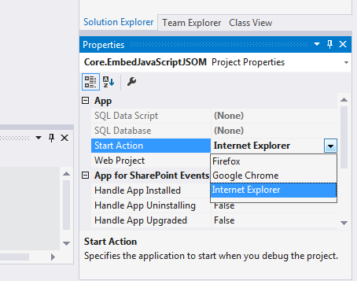

Je travaille sur un nouveau développement d'application Sharepoint et je dois souvent la déployer et tester. Mon navigateur par défaut est Google Chrome et chaque fois que je teste mon application, elle s'ouvre dans Chrome. Le problème est que je veux tester sur IE au lieu de Chrome car c'est le navigateur conseillé dans l'organisation où je vais déployer l'application. Je viens de découvrir que cela est vraiment simple à configurer dans Visual Studio, à travers les propriétés de la solution. Je peux choisir parmi les navigateurs disponibles dans : Properties &gt; Start Action :  Je n'ai pas eu à changer mon navigateur par défaut ni à copier/coller l'URL dans un autre navigateur à chaque fois que je veux tester l'application!!