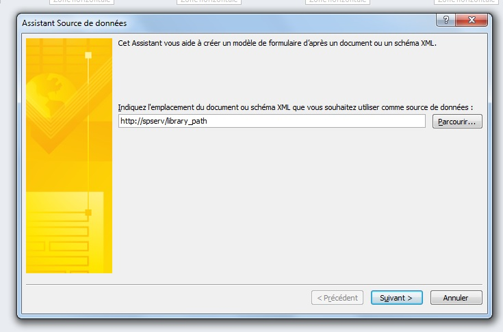
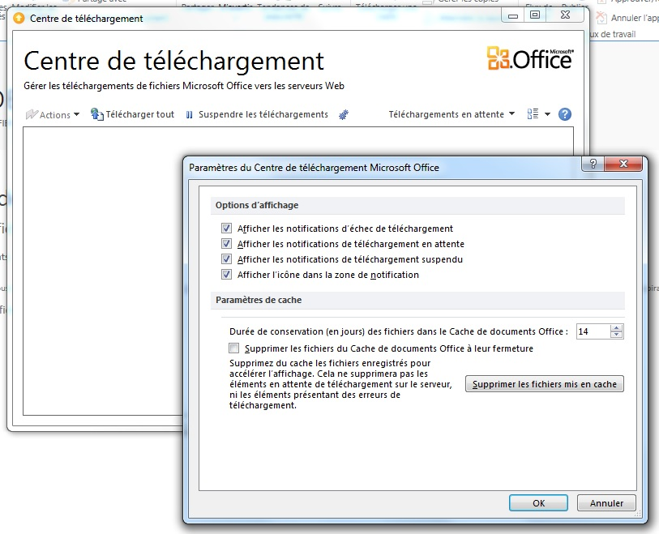

Nous avons récemment travaillé sur une bibliothèque SharePoint utilisant le panneau d'information InfoPath lors de la création de documents dans Office. Pour cela, un modèle XSN a été créé au départ mais entre temps, de nouvelles colonnes ont été ajoutées sur la bibliothèque. Ce changement n'est pas directement pris en compte dans le modèle et cela cause une erreur d'ouverture du panneau d'information dans un document :
```
Panneau Informations sur le document ne peut pas ouvrir un nouveau formulaire.
Le formulaire contient des erreurs de validation de schéma.
Élément « {4aea2928-6375-42a8-b951-d006a268fe52}Nom_De_Colonne » inattendu selon le modèle de contenu de l'élément parent « documentManagement ».
```
Pour palier à cela, il suffit de mettre à jour le modèle en le modifiant dans InfoPath. Voici les etapes à suivre :

*   Ouvrir les paramètre de la bibliothèque et trouver le lien "Paramètres du panneau Informations sur le document" dans les paramètre du type de contenu concerné.
*   Cliquer sur le lien "Modifier ce modèle" pour ouvrir le document dans InfoPath.
*   Dans InfoPath, aller dans le menu Données > Actualiser les champs
*   Renseigner l'url de la bibliothèque dans l'assistant qui s'affiche [](./err2.jpg)
*   Aller à l'étape suivante pour choisir le type de contenu à utiliser et terminer les étapes de l'assistant
*   Aller dans Fichier > Publier pour mettre à jour le modèle dans SharePoint
*   Vider le cache dans le centre de téléchargement d'Office (Menu Démarrer > Microsoft Office > Outils Microsoft Office 20XX > Microsoft Office 20XX Centre de téléchargement) [](./err3.jpg)

Une fois ces manipulations terminées, le panneau d'information s'affiche correctement dans Office.