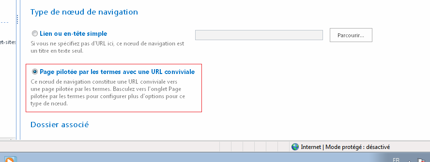
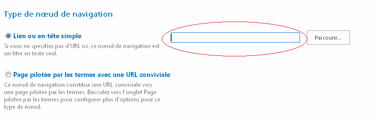

J'ai rencontré un problème assez perturbant sur un des sites SharePoint de nos clients. Nous avions mis en place un menu de navigation géré dans la banque de termes.  Ce menu est constitué de 5 éléments. Le problème est que l'affichage du menu n'était pas le même pour tous les utilisateurs. Pour les utilisateurs ayant une permission de lecture uniquement, certains éléments du menu ne s'affichaient pas. Cependant, si ces utilisateurs se rendaient directement sur l'URL, la page cible s'affiche bien car il n'y a aucune restriction dessus. Après plusieurs heures de recherches, un ami m'a finalement dirigé sur une piste  depuis une discussion sur [StackOverflow](http://sharepoint.stackexchange.com/questions/75636/permissions-and-managed-metadata-in-navigation#).  Le problème venait du fait que les éléments en question utilisaient l'option "**Page pilotée par les termes avec une URL conviviale**".  Il semble alors que des permissions sont nécessaire pour utiliser cette option dans certains cas, empêchant ainsi l'accès de ces éléments de menu aux utilisateurs sans autorisation.  Pour corriger le problème, il a fallu utiliser l'option "**Lien ou en-tête simple**" et saisir l'URL de la page cible.    Cette solution permet de résoudre le problème mais le revers de la médaille c'est qu'il n'est pas possible d'utiliser les URL conviviales avec cette option :(.  En tout cas, les amis de [http://sharepoint-community.net/](http://sharepoint-community.net/) m'ont bien aidé cette fois ci!