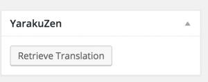

Je maintiens un blog Wordpress multilingue et je viens de découvrir [Yarakuzen](https://www.yarakuzen.com). C'est un outil innovant pour la traduction de texte qui offre un accès gratuit pour une utilisation personnelle. Il existe également des plans premium pour une utilisation intensive de l'outil. Cette application n'est pas comme les autres outils de traduction car il offre la possibilité d'ajuster la traduction comme je veux et les enregistrer. Plus je traduis du contenu, plus la traduction devient précise et personnalisée à mon goût. Donc, pour l'utiliser sur mon blog wordpress, je dois créer un compte [ici](https://app.yarakuzen.com/wordpress) et générer une clé API. J'ai également téléchargé le [plugin wordpress Yarakuzen](https://wordpress.org/plugins/yarakuzen/) qui est parfaitement intégré dans Wordpress. Le plugin vous demandera une clé publique et clé privée que vous pouvez générer depuis votre compte Yarakuzen:  Maintenant, quand je commence un nouvel article, je vois une nouvelle boîte du plugin Yarakuzen. Elle me permet d'envoyer le contenu de mon poste à Yarakuzen pour la traduction.  Voici comment j'utilise le plugin :

*   Je crée mon article dans une langue (disons l'anglais) et je l'enregistre
*   Je crée un autre poste pour la traduction et je coller le contenu de l'article source
*   J'envoie le texte pour traduction à Yarakuzen grace à la boîte
*   Je clique sur le bouton "Retrieve Translation" de la boîte Yarakuzen

 Cela remplacera mon contenu avec le texte traduit et il gardera aussi les médias, donc je ne pas besoin de les ajouter à nouveau dans la traduction. C'est un service qui est vraiment utile pour moi et je sens que je vais l'utiliser très souvent.Vous pouvez en apprendre plus sur Yarakuzen et leurs plans et services sur [yarakuzen.com](http://yarakuzen.com)