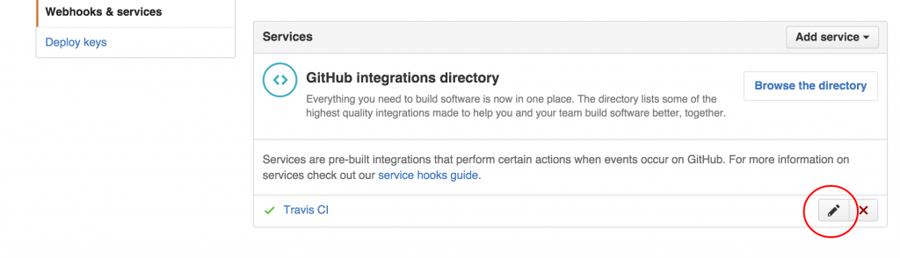

Working on a small package [Atom](https://atom.io/packages/atom-numbers) lately, I started to configure [Travis CI](http://travis-ci.org/) to automatically launch my builds and tests.This allows me to ensure that the future push and pull requests of my project do not break anything. As this is an opensource project, I can use Github free TravisCI services. My repository is installed on G[ithub](https://github.com/mikaoelitiana/atom-numbers) and I started to activate webhook Travic CI in parameters. To do this, go to _Settings> Webhooks & Services> Travic CI _and activate this service by clicking edit button.  You must now set Travis CI. My Travis CI account is linked to my Github account so I can find the list of my repository and I chose the one that is concerned.  Finally, to start the work of travis, add a .travis.yml file in the root of the project. This file contains the information necessary for Travis and configuration for actions to run. Regarding the Atom packages, a repository has been deployed to easily set up Travis configurations. Just go to [https://github.com/atom/ci/blob/master/.travis.yml](https://github.com/atom/ci/blob/master/.travis.yml) and use it. When I makes new push on the repository, Travis will now launch automatically builds and keep me informed in case of problems. To top it all, I can have the small button indicating the status of the repository.It can easily be integrated on a web page or on my project README  For Atom packages, it is also possible to use other services or as AppVeyor Circle. The details for these are also available on the directory[https://github.com/atom/ci/](https://github.com/atom/ci/) Et voila, your turn now!